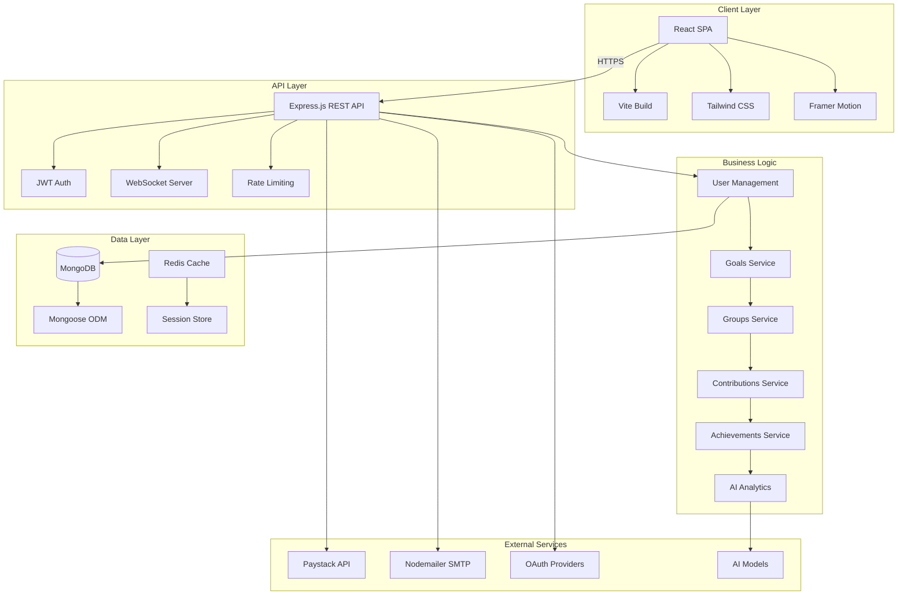

<div align="center">

# 🔄 LoopFund

### *Smart Savings, Smarter Future*

[](https://github.com/yourusername/loopfund)
[](LICENSE)
[](https://github.com/yourusername/loopfund)
[](https://nodejs.org/)
[](https://reactjs.org/)

**A next-generation fintech platform revolutionizing collaborative savings for African markets**

[🌐 Live Demo](https://loopfund.app) · [📖 Documentation](docs/) · [🐛 Report Bug](issues/) · [✨ Request Feature](issues/)

</div>

---

## 🎯 Vision & Mission

**LoopFund** is a fintech startup building the future of collaborative savings and financial wellness in Africa. We combine social savings traditions with modern technology to help individuals and communities achieve their financial goals faster and smarter.

### 💡 The Problem We're Solving

Traditional savings methods lack accountability, accessibility, and incentivization. Over **60% of Africans** remain unbanked or underbanked, relying on informal savings groups that are prone to mismanagement and lack of trust.

### 🚀 Our Solution

A digital platform that combines:
- 🎯 **Smart Goal Tracking** - AI-powered savings recommendations
- 👥 **Social Accountability** - Group savings with friends & family
- 🎮 **Gamification** - Achievements, challenges, and rewards
- 💳 **Seamless Payments** - Integrated payment processing
- 📊 **Financial Insights** - Real-time analytics and reporting

---

## 🏗️ Architecture



---

## 💻 Tech Stack

<div align="center">

### Frontend
[](https://reactjs.org/)
[](https://vitejs.dev/)
[](https://tailwindcss.com/)
[](https://www.framer.com/motion/)

### Backend
[](https://nodejs.org/)
[](https://expressjs.com/)
[](https://www.mongodb.com/)
[](https://socket.io/)

### DevOps & Tools
[](https://git-scm.com/)
[](https://eslint.org/)
[](https://jwt.io/)
[](https://paystack.com/)

</div>

---

## ✨ Core Features

<table>
<tr>
<td width="50%">

### 🎯 Individual Goals
- **Smart Goal Creation** with AI suggestions
- **Visual Progress Tracking** with charts
- **Direct Contributions** with Paystack
- **Revenue Model**: First goal free, 2-3% fee on subsequent goals
- **Auto-savings** based on spending patterns

</td>
<td width="50%">

### 👥 Group Savings
- **Create/Join Groups** with friends & family
- **Flexible Durations**: Weekly to 5+ years
- **Dynamic Fee Calculation** based on commitment
- **Member Invitations** via email/QR codes
- **Transparent Group Analytics**

</td>
</tr>
<tr>
<td width="50%">

### 🏆 Gamification
- **Achievement Badges** for milestones
- **Community Challenges** with prizes
- **Leaderboards** for top savers
- **Therapy Games** for financial wellness
- **Social Sharing** of successes

</td>
<td width="50%">

### 📊 Analytics & Insights
- **Real-time Dashboard** with key metrics
- **AI-Powered Predictions** for savings
- **Spending Pattern Analysis**
- **Goal Performance Reports**
- **Financial Health Score**

</td>
</tr>
</table>

---

## 🎨 Design Philosophy

LoopFund features a custom design system built around:

- **🎨 Brand Colors**: Emerald, Coral, Gold, Lavender
- **🌓 Dark Mode**: Full support with elegant transitions
- **📱 Mobile-First**: Responsive design optimized for all devices
- **⚡ Smooth Animations**: Powered by Framer Motion
- **♿ Accessibility**: WCAG 2.1 AA compliant

> For detailed design guidelines, see [LOOPFUND_PROJECT_CONTEXT.md](LOOPFUND_PROJECT_CONTEXT.md)

---

## 🚀 Quick Start

### Prerequisites

```bash
Node.js >= 16.0.0
MongoDB >= 4.4
npm or yarn
Git
```

### Installation

```bash
# 1. Clone the repository
git clone https://github.com/yourusername/loopfund.git
cd loopfund

# 2. Install backend dependencies
cd backend
npm install

# 3. Install frontend dependencies
cd ../frontend
npm install

# 4. Set up environment variables
cp backend/.env.example backend/.env
cp frontend/.env.example frontend/.env
# Edit .env files with your configuration

# 5. Start MongoDB
# Make sure MongoDB is running on localhost:27017

# 6. Start the backend server
cd backend
npm run dev
# Backend runs on http://localhost:4000

# 7. Start the frontend dev server (in a new terminal)
cd frontend
npm run dev
# Frontend runs on http://localhost:5173
```

### Environment Configuration

#### Backend `.env`
```env
# Database
MONGODB_URI=mongodb://localhost:27017/loopfund
REDIS_URL=redis://localhost:6379

# Authentication
JWT_SECRET=your_super_secret_jwt_key_here
JWT_REFRESH_SECRET=your_refresh_token_secret_here
JWT_EXPIRES_IN=7d
JWT_REFRESH_EXPIRES_IN=30d

# Payment Integration
PAYSTACK_SECRET_KEY=sk_test_your_secret_key_here
PAYSTACK_PUBLIC_KEY=pk_test_your_public_key_here
PAYSTACK_WEBHOOK_SECRET=your_webhook_secret_here

# Email Configuration
SMTP_HOST=smtp.gmail.com
SMTP_PORT=587
SMTP_USER=your-email@gmail.com
SMTP_PASS=your-app-password
FROM_EMAIL=noreply@loopfund.app
FROM_NAME=LoopFund

# OAuth
GOOGLE_CLIENT_ID=your_google_client_id
GOOGLE_CLIENT_SECRET=your_google_client_secret
GOOGLE_CALLBACK_URL=http://localhost:4000/api/auth/google/callback

# Application
NODE_ENV=development
PORT=4000
FRONTEND_URL=http://localhost:5173
API_BASE_URL=http://localhost:4000
```

#### Frontend `.env`
```env
VITE_API_URL=http://localhost:4000/api
VITE_WS_URL=ws://localhost:4000
VITE_PAYSTACK_PUBLIC_KEY=pk_test_your_public_key_here
VITE_APP_NAME=LoopFund
VITE_APP_VERSION=2.0.0
```

---

## 📊 Project Structure

```
LoopFund/
├── 📱 frontend/                 # React SPA Application
│   ├── src/
│   │   ├── components/          # Reusable UI components
│   │   │   ├── ui/             # Core LoopFund design system
│   │   │   ├── auth/           # Authentication components
│   │   │   ├── dashboard/      # Dashboard widgets
│   │   │   ├── goals/          # Goal management components
│   │   │   ├── groups/         # Group features
│   │   │   ├── community/      # Community & social features
│   │   │   ├── payments/       # Payment components
│   │   │   ├── notifications/  # Notification components
│   │   │   └── layout/         # Layout & navigation
│   │   ├── pages/              # Page components
│   │   ├── services/           # API service layer
│   │   ├── store/              # Zustand state management
│   │   ├── context/            # React context providers
│   │   ├── hooks/              # Custom React hooks
│   │   ├── utils/              # Utility functions
│   │   └── styles/             # Global styles
│   ├── public/                 # Static assets
│   └── package.json
│
├── 🔧 backend/                  # Node.js API Server
│   ├── src/
│   │   ├── controllers/        # Request handlers
│   │   │   ├── auth.controller.js
│   │   │   ├── goals.controller.js
│   │   │   ├── groups.controller.js
│   │   │   ├── contributions.controller.js
│   │   │   ├── achievements.controller.js
│   │   │   ├── analytics.controller.js
│   │   │   ├── wallet.controller.js
│   │   │   └── ai.controller.js
│   │   ├── models/             # Mongoose schemas
│   │   │   ├── User.js
│   │   │   ├── Goal.js
│   │   │   ├── Group.js
│   │   │   ├── Contribution.js
│   │   │   ├── Achievement.js
│   │   │   ├── Wallet.js
│   │   │   └── Payment.js
│   │   ├── routes/             # API endpoints
│   │   ├── services/           # Business logic layer
│   │   │   ├── auth.service.js
│   │   │   ├── goal.service.js
│   │   │   ├── group.service.js
│   │   │   ├── payment.service.js
│   │   │   └── notification.service.js
│   │   ├── middleware/         # Custom middleware
│   │   │   ├── auth.js
│   │   │   ├── errorHandler.js
│   │   │   └── validateRequest.js
│   │   ├── config/             # Configuration files
│   │   │   ├── db.js
│   │   │   ├── passport.js
│   │   │   └── paystack.js
│   │   ├── websocket/          # WebSocket handlers
│   │   └── server.js           # Entry point
│   ├── ai/                     # AI/ML services
│   │   ├── behavioral_analyzer.py
│   │   ├── financial_advisor.py
│   │   └── savings_predictor.py
│   └── package.json
│
├── 📚 docs/                     # Documentation (planned)
├── 🧪 tests/                    # Test suites (planned)
├── 🚀 .github/                  # GitHub workflows (planned)
├── 📄 LOOPFUND_PROJECT_CONTEXT.md  # Design system & guidelines
└── 📄 README.md                 # This file
```

---

## 🔐 Security Features

- 🔒 **JWT Authentication** with refresh tokens
- 🛡️ **bcrypt Password Hashing** (10 rounds)
- 🔐 **OAuth 2.0 Integration** (Google, more coming)
- 🚫 **Rate Limiting** (100 requests/15 minutes)
- 🛡️ **Helmet.js** security headers
- ✅ **Input Validation** with express-validator
- 🔒 **CORS Protection** with whitelist
- 📝 **Request Logging** with Morgan
- 🔐 **Environment Variables** for secrets
- 💳 **PCI-DSS Compliant** payment processing

---

## 📡 API Documentation

### Authentication Endpoints

```http
POST   /api/auth/register           # User registration
POST   /api/auth/login              # User login
POST   /api/auth/refresh            # Refresh access token
POST   /api/auth/logout             # User logout
GET    /api/auth/google             # Google OAuth
POST   /api/auth/forgot-password    # Password reset request
POST   /api/auth/reset-password     # Password reset
```

### Goals Management

```http
GET    /api/goals                   # Get user goals
POST   /api/goals                   # Create new goal
GET    /api/goals/:id               # Get single goal
PUT    /api/goals/:id               # Update goal
DELETE /api/goals/:id               # Delete goal
POST   /api/goals/:id/contribute    # Make contribution
```

### Groups Management

```http
GET    /api/groups                  # Get user groups
POST   /api/groups                  # Create new group
GET    /api/groups/:id              # Get group details
PUT    /api/groups/:id              # Update group
DELETE /api/groups/:id              # Delete group
POST   /api/groups/:id/join         # Join group
POST   /api/groups/:id/invite       # Invite members
POST   /api/groups/:id/contribute   # Make contribution
```

### Payments

```http
POST   /api/payments/initialize-goal      # Initialize goal payment
POST   /api/payments/initialize-group     # Initialize group payment
GET    /api/payments/verify/:reference    # Verify payment
POST   /api/payments/calculate-fee        # Calculate fee
GET    /api/payments/history              # Payment history
POST   /api/payments/webhook              # Paystack webhook
```

### Analytics & Achievements

```http
GET    /api/analytics/dashboard     # Dashboard stats
GET    /api/analytics/goals         # Goal analytics
GET    /api/analytics/groups        # Group analytics
GET    /api/achievements            # User achievements
GET    /api/achievements/leaderboard # Community leaderboard
```

> Full API documentation with Swagger will be available at `/api-docs` (in development)

---

## 🎮 Testing

### Test Cards (Paystack Test Mode)

```
Card Number:  4084 0840 8408 4081 (Visa)
              5043 8500 0000 0008 (Mastercard)
Expiry Date:  Any future date (e.g., 12/25)
CVV:          Any 3 digits (e.g., 123)
PIN:          Any 4 digits (e.g., 1234)
OTP:          123456
```

### Running Tests

```bash
# Backend unit tests
cd backend
npm test

# Frontend component tests
cd frontend
npm test

# End-to-end tests
npm run test:e2e

# Test coverage
npm run test:coverage
```

---

## 🚦 Roadmap & Future Plans

### 📅 Q1 2025 - Foundation Enhancement
- [x] Core savings platform (Goals & Groups)
- [x] Paystack payment integration
- [x] User authentication & authorization
- [x] Dashboard & analytics
- [ ] Comprehensive test coverage (80%+)
- [ ] CI/CD pipeline setup
- [ ] Performance optimization

### 📅 Q2 2025 - Advanced Features
- [ ] **AI Financial Advisor** - Personalized savings recommendations
- [ ] **Auto-Savings** - Round-up transactions & smart deposits
- [ ] **Investment Portfolio** - Mutual funds & bonds integration
- [ ] **Mobile Apps** - React Native iOS & Android
- [ ] **Push Notifications** - Real-time alerts
- [ ] **Advanced Analytics** - ML-powered insights

### 📅 Q3 2025 - Scale & Expand
- [ ] **Multi-Currency Support** - USD, GHS, KES, ZAR
- [ ] **Microservices Architecture** - Scalability improvements
- [ ] **Advanced Security** - 2FA, biometric auth
- [ ] **B2B Features** - Corporate savings programs
- [ ] **API Marketplace** - Developer integrations
- [ ] **White-Label Solution** - Partners & resellers

### 📅 Q4 2025 - Market Leadership
- [ ] **Banking Integration** - Direct bank connections
- [ ] **Loan Services** - Credit based on savings history
- [ ] **Insurance Products** - Micro-insurance offerings
- [ ] **Regional Expansion** - 10+ African countries
- [ ] **Fintech Partnerships** - Strategic alliances
- [ ] **Series A Funding** - Scale operations

---

## 💼 Business Model

### Revenue Streams

1. **Goal Fees** (2-3%)
   - First goal: FREE (user acquisition)
   - Subsequent goals: 2-3% processing fee
   - Estimated: $5-15 per active user/year

2. **Group Fees** (Based on duration)
   - Weekly groups: 1% fee
   - Monthly groups: 2% fee
   - Yearly groups: 3% fee
   - Estimated: $10-50 per group/year

3. **Premium Features** (Planned)
   - AI Financial Advisor: $4.99/month
   - Investment Portfolio: 1% AUM fee
   - Priority Support: $2.99/month

4. **B2B Solutions** (Planned)
   - Corporate savings programs: Custom pricing
   - White-label solutions: Licensing fees
   - API integrations: Usage-based pricing

### Market Opportunity

- **TAM**: 600M+ unbanked/underbanked adults in Africa
- **SAM**: 150M+ smartphone users in target markets
- **SOM**: 1M+ users within 24 months (0.67% of SAM)
- **Revenue Projection**: $5M+ ARR by Year 3

---

## 📈 Traction & Metrics

<div align="center">

| Metric | Current | Target (6 months) |
|--------|---------|-------------------|
| 👥 Active Users | Development | 10,000+ |
| 💰 Total Savings | Development | ₦50M+ |
| 🎯 Goals Created | Development | 25,000+ |
| 👥 Groups Formed | Development | 5,000+ |
| 🏆 Achievements Unlocked | Development | 100,000+ |
| ⭐ User Retention (30-day) | Development | 70%+ |

</div>

---

## 👥 Team

<div align="center">

**Built by passionate developers solving real-world problems**

🚀 Full-Stack Development | 💡 Product Design | 📊 Data Analytics | 🎯 Growth Strategy

*Join us in revolutionizing savings culture in Africa*

</div>

---

## 🤝 Contributing

We're currently in private development. If you're interested in contributing or partnering:

1. **Report Bugs** - Use GitHub Issues
2. **Feature Requests** - Submit detailed proposals
3. **Partnerships** - Contact: partnerships@loopfund.app
4. **Investment Inquiries** - Contact: invest@loopfund.app

---

## 📄 License

**Proprietary & Confidential**

© 2024-2025 LoopFund. All rights reserved.

This software and associated documentation are proprietary and confidential. Unauthorized copying, distribution, or use is strictly prohibited.

---

## 📞 Contact & Support

<div align="center">

📧 **Email**: support@loopfund.app  
🌐 **Website**: https://loopfund.app  
🐦 **Twitter**: [@LoopFundApp](https://twitter.com/loopfundapp)  
📱 **LinkedIn**: [LoopFund](https://linkedin.com/company/loopfund)  

---

**Made with ❤️ for Africa | Powered by Technology | Driven by Impact**

⭐ Star this repo if you believe in our mission!

</div>
