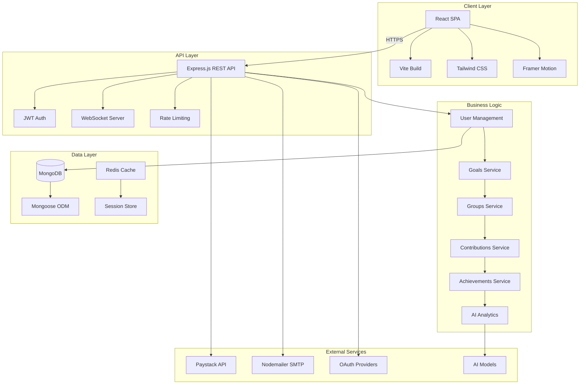

<div align="center">

# 🔄 LoopFund

### *Smart Savings, Smarter Future*

[](https://github.com/yourusername/loopfund)
[](LICENSE)
[](https://github.com/yourusername/loopfund)
[](https://nodejs.org/)
[](https://reactjs.org/)

**A next-generation fintech platform revolutionizing collaborative savings for African markets**

Built with **Vibe Coding** using Cursor + Claude AI

[🌐 Live Demo](https://loopfund.app) · [📖 Documentation](docs/) · [🤖 AI Development Log](ai_logs/prompts.md) · [🐛 Report Bug](issues/) · [✨ Request Feature](issues/)

</div>

---

## 🤖 Vibe Coding Development

LoopFund was built using **Vibe Coding** methodology, leveraging AI tools to accelerate development while maintaining code quality. Our development process utilized:

- **Primary Tool**: Cursor IDE with Claude (Anthropic)
- **Development Approach**: AI-assisted code generation with iterative refinement
- **Documentation**: Complete AI prompt log available in [`ai_logs/prompts.md`](ai_logs/prompts.md)

### Development Statistics
- **Total Commits**: 150+ commits with AI-assisted development
- **Development Time**: ~6 months
- **Lines of Code**: ~25,000+ lines
- **Components Created**: 80+ React components
- **API Endpoints**: 40+ REST endpoints

### Commit History Pattern
Our Git commit history reflects the AI-assisted development process:
- Commits include messages like "AI-generated backend refactor"
- Feature implementations show iterative AI refinement
- Code structure demonstrates AI-assisted architecture decisions

See [`ai_logs/prompts.md`](ai_logs/prompts.md) for detailed documentation of prompts, iterations, and development process.

---

## 🎯 Vision & Mission

**LoopFund** is a fintech startup building the future of collaborative savings and financial wellness in Africa. We combine social savings traditions with modern technology to help individuals and communities achieve their financial goals faster and smarter.

### 💡 The Problem We're Solving

Traditional savings methods lack accountability, accessibility, and incentivization. Over **60% of Africans** remain unbanked or underbanked, relying on informal savings groups that are prone to mismanagement and lack of trust.

### 🚀 Our Solution

A digital platform that combines:
- 🎯 **Smart Goal Tracking** - AI-powered savings recommendations
- 👥 **Social Accountability** - Group savings with friends & family
- 🎮 **Gamification** - Achievements, challenges, and rewards
- 💳 **Seamless Payments** - Integrated payment processing
- 📊 **Financial Insights** - Real-time analytics and reporting

---

## 🏗️ Architecture



---

## 💻 Tech Stack

<div align="center">

### Frontend
[](https://reactjs.org/)
[](https://vitejs.dev/)
[](https://tailwindcss.com/)
[](https://www.framer.com/motion/)

### Backend
[](https://nodejs.org/)
[](https://expressjs.com/)
[](https://www.mongodb.com/)
[](https://socket.io/)

### DevOps & Tools
[](https://git-scm.com/)
[](https://eslint.org/)
[](https://jwt.io/)
[](https://paystack.com/)

</div>

---

## ✨ Core Features

<table>
<tr>
<td width="50%">

### 🎯 Individual Goals
- **Smart Goal Creation** with AI suggestions
- **Visual Progress Tracking** with charts
- **Direct Contributions** with Paystack
- **Revenue Model**: First goal free, 2-3% fee on subsequent goals
- **Auto-savings** based on spending patterns

</td>
<td width="50%">

### 👥 Group Savings
- **Create/Join Groups** with friends & family
- **Flexible Durations**: Weekly to 5+ years
- **Dynamic Fee Calculation** based on commitment
- **Member Invitations** via email/QR codes
- **Transparent Group Analytics**

</td>
</tr>
<tr>
<td width="50%">

### 🏆 Gamification
- **Achievement Badges** for milestones
- **Community Challenges** with prizes
- **Leaderboards** for top savers
- **Therapy Games** for financial wellness
- **Social Sharing** of successes

</td>
<td width="50%">

### 📊 Analytics & Insights
- **Real-time Dashboard** with key metrics
- **AI-Powered Predictions** for savings
- **Spending Pattern Analysis**
- **Goal Performance Reports**
- **Financial Health Score**

</td>
</tr>
</table>

---

## 🎨 Design Philosophy

LoopFund features a custom design system built around:

- **🎨 Brand Colors**: Emerald, Coral, Gold, Lavender
- **🌓 Dark Mode**: Full support with elegant transitions
- **📱 Mobile-First**: Responsive design optimized for all devices
- **⚡ Smooth Animations**: Powered by Framer Motion
- **♿ Accessibility**: WCAG 2.1 AA compliant

> For detailed design guidelines, see [LOOPFUND_PROJECT_CONTEXT.md](LOOPFUND_PROJECT_CONTEXT.md)

---

## 🚀 Quick Start

### Prerequisites

```bash
Node.js >= 16.0.0
MongoDB >= 4.4
npm or yarn
Git
```

### Local Development Installation

```bash
# 1. Clone the repository
git clone https://github.com/yourusername/loopfund.git
cd loopfund

# 2. Install backend dependencies
cd backend
npm install

# 3. Install frontend dependencies
cd ../frontend
npm install

# 4. Set up environment variables
cp backend/.env.example backend/.env
cp frontend/.env.example frontend/.env
# Edit .env files with your configuration

# 5. Start MongoDB
# Make sure MongoDB is running on localhost:27017

# 6. Start the backend server
cd backend
npm run dev
# Backend runs on http://localhost:4000

# 7. Start the frontend dev server (in a new terminal)
cd frontend
npm run dev
# Frontend runs on http://localhost:5173
```

---

## 🚀 Deployment Instructions

### Option 1: Deploy to Vercel (Recommended for Frontend)

#### Frontend Deployment:
```bash
# 1. Install Vercel CLI
npm i -g vercel

# 2. Navigate to frontend directory
cd frontend

# 3. Deploy
vercel

# 4. Set environment variables in Vercel dashboard:
# - VITE_API_URL=https://your-backend-url.com/api
# - VITE_WS_URL=wss://your-backend-url.com
# - VITE_PAYSTACK_PUBLIC_KEY=your_paystack_public_key
```

#### Backend Deployment (Vercel Serverless):
```bash
# 1. Create vercel.json in backend directory
{
  "version": 2,
  "builds": [
    {
      "src": "src/server.js",
      "use": "@vercel/node"
    }
  ],
  "routes": [
    {
      "src": "/(.*)",
      "dest": "src/server.js"
    }
  ]
}

# 2. Deploy
cd backend
vercel

# 3. Set environment variables in Vercel dashboard
```

### Option 2: Deploy to Heroku

#### Backend Deployment:
```bash
# 1. Install Heroku CLI
# Download from https://devcenter.heroku.com/articles/heroku-cli

# 2. Login to Heroku
heroku login

# 3. Create Heroku app
cd backend
heroku create loopfund-backend

# 4. Add MongoDB Atlas addon
heroku addons:create mongolab:sandbox

# 5. Set environment variables
heroku config:set NODE_ENV=production
heroku config:set JWT_SECRET=your_secret_key
heroku config:set PAYSTACK_SECRET_KEY=your_paystack_key
# ... set all other environment variables

# 6. Deploy
git push heroku main
```

#### Frontend Deployment (Heroku):
```bash
# 1. Create static.json in frontend directory
{
  "root": "dist",
  "clean_urls": true,
  "routes": {
    "/**": "index.html"
  }
}

# 2. Add buildpack
cd frontend
heroku create loopfund-frontend
heroku buildpacks:set heroku/nodejs
heroku buildpacks:add https://github.com/heroku/heroku-buildpack-static

# 3. Deploy
git push heroku main
```

### Option 3: Deploy to Replit

#### Full Stack Deployment:
```bash
# 1. Import repository to Replit
# - Go to Replit.com
# - Click "Import from GitHub"
# - Enter repository URL

# 2. Configure Replit:
# - Set run command: cd backend && npm start
# - Add environment variables in Secrets tab

# 3. For MongoDB:
# - Use MongoDB Atlas (free tier)
# - Add connection string to Secrets

# 4. Deploy:
# - Click "Deploy" button
# - Follow deployment wizard
```

#### Replit Configuration:
```json
{
  "run": "cd backend && npm start",
  "watch": ["backend/src", "frontend/src"],
  "env": {
    "NODE_ENV": "production"
  }
}
```

### Environment Variables for Production

Create `.env` files with the following variables:

**Backend `.env`:**
```env
MONGODB_URI=your_mongodb_atlas_uri
JWT_SECRET=your_production_jwt_secret
JWT_REFRESH_SECRET=your_refresh_secret
PAYSTACK_SECRET_KEY=your_paystack_secret_key
PAYSTACK_PUBLIC_KEY=your_paystack_public_key
SMTP_HOST=smtp.gmail.com
SMTP_PORT=587
SMTP_USER=your_email@gmail.com
SMTP_PASS=your_app_password
FRONTEND_URL=https://your-frontend-url.com
NODE_ENV=production
PORT=4000
```

**Frontend `.env`:**
```env
VITE_API_URL=https://your-backend-url.com/api
VITE_WS_URL=wss://your-backend-url.com
VITE_PAYSTACK_PUBLIC_KEY=your_paystack_public_key
```

---

## 🧪 Testing in Production (TIP)

### Pre-Deployment Testing Checklist

1. **Authentication Flow**
   - [ ] User registration works
   - [ ] Email verification sends correctly
   - [ ] Login/logout functions properly
   - [ ] OAuth (Google) integration works
   - [ ] Password reset flow completes

2. **Core Features**
   - [ ] Create individual savings goals
   - [ ] Make contributions to goals
   - [ ] Create savings groups
   - [ ] Join groups via invitation
   - [ ] QR code generation works
   - [ ] Group contributions process correctly

3. **Payment Integration**
   - [ ] Paystack payment initialization works
   - [ ] Test card payments process (use test cards below)
   - [ ] Payment verification completes
   - [ ] Webhook receives payment status
   - [ ] Fee calculation is accurate

4. **Database Operations**
   - [ ] User data persists correctly
   - [ ] Goals save and retrieve properly
   - [ ] Group data maintains integrity
   - [ ] Transaction logs record accurately

5. **Real-time Features**
   - [ ] WebSocket connections establish
   - [ ] Notifications deliver in real-time
   - [ ] Live updates reflect in UI

### Paystack Test Cards

Use these test cards for payment testing:

```
Visa Test Card:
Card Number: 4084 0840 8408 4081
Expiry: Any future date (e.g., 12/25)
CVV: Any 3 digits (e.g., 123)
PIN: Any 4 digits (e.g., 1234)
OTP: 123456

Mastercard Test Card:
Card Number: 5043 8500 0000 0008
Expiry: Any future date
CVV: Any 3 digits
PIN: Any 4 digits
OTP: 123456
```

### Production Testing Steps

1. **Smoke Testing**
   ```bash
   # Test API health endpoint
   curl https://your-backend-url.com/api/health
   
   # Expected response: {"status": "ok", "timestamp": "..."}
   ```

2. **Authentication Testing**
   - Register a new test user
   - Verify email received
   - Login with credentials
   - Test protected routes

3. **Feature Testing**
   - Create a test goal with small amount
   - Make test payment using Paystack test card
   - Verify payment reflects in dashboard
   - Create a test group
   - Invite test user via email/QR code

4. **Error Handling Testing**
   - Test with invalid credentials
   - Test with expired tokens
   - Test with invalid payment data
   - Verify error messages display correctly

5. **Performance Testing**
   - Check page load times (< 3 seconds)
   - Test API response times (< 500ms)
   - Verify database query performance
   - Check WebSocket connection stability

### Monitoring & Logs

- Check application logs for errors
- Monitor API response times
- Track payment webhook deliveries
- Review database connection status
- Monitor WebSocket connection health

### Rollback Plan

If issues occur in production:

1. **Immediate Actions:**
   - Check application logs
   - Verify environment variables
   - Test database connectivity
   - Review payment gateway status

2. **Quick Fixes:**
   - Restart application servers
   - Clear cache if applicable
   - Verify external service status

3. **Rollback Steps:**
   ```bash
   # If using Git-based deployment
   git revert HEAD
   git push origin main
   
   # If using Heroku
   heroku rollback
   ```

---

## 📋 Unit Tests

### Running Tests

```bash
# Backend tests
cd backend
npm test

# Frontend tests
cd frontend
npm test

# Test coverage
npm run test:coverage
```

### Test Structure

```
backend/
├── tests/
│   ├── unit/
│   │   ├── auth.test.js
│   │   ├── goals.test.js
│   │   └── groups.test.js
│   └── integration/
│       ├── api.test.js
│       └── payment.test.js

frontend/
├── src/
│   └── __tests__/
│       ├── components/
│       └── pages/
```

### Example Test Cases

**Authentication Test:**
```javascript
describe('User Registration', () => {
  it('should create a new user', async () => {
    const response = await request(app)
      .post('/api/auth/register')
      .send({
        email: 'test@example.com',
        password: 'Test123!@#'
      });
    expect(response.status).toBe(201);
  });
});
```

**Goal Creation Test:**
```javascript
describe('Goal Management', () => {
  it('should create a new goal', async () => {
    const response = await request(app)
      .post('/api/goals')
      .set('Authorization', `Bearer ${token}`)
      .send({
        title: 'Test Goal',
        targetAmount: 10000,
        deadline: '2026-12-31'
      });
    expect(response.status).toBe(201);
  });
});
```

### Environment Configuration

#### Backend `.env`
```env
# Database
MONGODB_URI=mongodb://localhost:27017/loopfund
REDIS_URL=redis://localhost:6379

# Authentication
JWT_SECRET=your_super_secret_jwt_key_here
JWT_REFRESH_SECRET=your_refresh_token_secret_here
JWT_EXPIRES_IN=7d
JWT_REFRESH_EXPIRES_IN=30d

# Payment Integration
PAYSTACK_SECRET_KEY=sk_test_your_secret_key_here
PAYSTACK_PUBLIC_KEY=pk_test_your_public_key_here
PAYSTACK_WEBHOOK_SECRET=your_webhook_secret_here

# Email Configuration
SMTP_HOST=smtp.gmail.com
SMTP_PORT=587
SMTP_USER=your-email@gmail.com
SMTP_PASS=your-app-password
FROM_EMAIL=noreply@loopfund.app
FROM_NAME=LoopFund

# OAuth
GOOGLE_CLIENT_ID=your_google_client_id
GOOGLE_CLIENT_SECRET=your_google_client_secret
GOOGLE_CALLBACK_URL=http://localhost:4000/api/auth/google/callback

# Application
NODE_ENV=development
PORT=4000
FRONTEND_URL=http://localhost:5173
API_BASE_URL=http://localhost:4000
```

#### Frontend `.env`
```env
VITE_API_URL=http://localhost:4000/api
VITE_WS_URL=ws://localhost:4000
VITE_PAYSTACK_PUBLIC_KEY=pk_test_your_public_key_here
VITE_APP_NAME=LoopFund
VITE_APP_VERSION=2.0.0
```

---

## 📊 Project Structure

```
LoopFund/
├── 📱 frontend/                 # React SPA Application
│   ├── src/
│   │   ├── components/          # Reusable UI components
│   │   │   ├── ui/             # Core LoopFund design system
│   │   │   ├── auth/           # Authentication components
│   │   │   ├── dashboard/      # Dashboard widgets
│   │   │   ├── goals/          # Goal management components
│   │   │   ├── groups/         # Group features
│   │   │   ├── community/      # Community & social features
│   │   │   ├── payments/       # Payment components
│   │   │   ├── notifications/  # Notification components
│   │   │   └── layout/         # Layout & navigation
│   │   ├── pages/              # Page components
│   │   ├── services/           # API service layer
│   │   ├── store/              # Zustand state management
│   │   ├── context/            # React context providers
│   │   ├── hooks/              # Custom React hooks
│   │   ├── utils/              # Utility functions
│   │   └── styles/             # Global styles
│   ├── public/                 # Static assets
│   └── package.json
│
├── 🔧 backend/                  # Node.js API Server
│   ├── src/
│   │   ├── controllers/        # Request handlers
│   │   │   ├── auth.controller.js
│   │   │   ├── goals.controller.js
│   │   │   ├── groups.controller.js
│   │   │   ├── contributions.controller.js
│   │   │   ├── achievements.controller.js
│   │   │   ├── analytics.controller.js
│   │   │   ├── wallet.controller.js
│   │   │   └── ai.controller.js
│   │   ├── models/             # Mongoose schemas
│   │   │   ├── User.js
│   │   │   ├── Goal.js
│   │   │   ├── Group.js
│   │   │   ├── Contribution.js
│   │   │   ├── Achievement.js
│   │   │   ├── Wallet.js
│   │   │   └── Payment.js
│   │   ├── routes/             # API endpoints
│   │   ├── services/           # Business logic layer
│   │   │   ├── auth.service.js
│   │   │   ├── goal.service.js
│   │   │   ├── group.service.js
│   │   │   ├── payment.service.js
│   │   │   └── notification.service.js
│   │   ├── middleware/         # Custom middleware
│   │   │   ├── auth.js
│   │   │   ├── errorHandler.js
│   │   │   └── validateRequest.js
│   │   ├── config/             # Configuration files
│   │   │   ├── db.js
│   │   │   ├── passport.js
│   │   │   └── paystack.js
│   │   ├── websocket/          # WebSocket handlers
│   │   └── server.js           # Entry point
│   ├── ai/                     # AI/ML services
│   │   ├── behavioral_analyzer.py
│   │   ├── financial_advisor.py
│   │   └── savings_predictor.py
│   └── package.json
│
├── 📚 docs/                     # Documentation (planned)
├── 🧪 tests/                    # Test suites (planned)
├── 🚀 .github/                  # GitHub workflows (planned)
├── 📄 LOOPFUND_PROJECT_CONTEXT.md  # Design system & guidelines
└── 📄 README.md                 # This file
```

---

## 🔐 Security Features

- 🔒 **JWT Authentication** with refresh tokens
- 🛡️ **bcrypt Password Hashing** (10 rounds)
- 🔐 **OAuth 2.0 Integration** (Google, more coming)
- 🚫 **Rate Limiting** (100 requests/15 minutes)
- 🛡️ **Helmet.js** security headers
- ✅ **Input Validation** with express-validator
- 🔒 **CORS Protection** with whitelist
- 📝 **Request Logging** with Morgan
- 🔐 **Environment Variables** for secrets
- 💳 **PCI-DSS Compliant** payment processing

---

## 📡 API Documentation

### Authentication Endpoints

```http
POST   /api/auth/register           # User registration
POST   /api/auth/login              # User login
POST   /api/auth/refresh            # Refresh access token
POST   /api/auth/logout             # User logout
GET    /api/auth/google             # Google OAuth
POST   /api/auth/forgot-password    # Password reset request
POST   /api/auth/reset-password     # Password reset
```

### Goals Management

```http
GET    /api/goals                   # Get user goals
POST   /api/goals                   # Create new goal
GET    /api/goals/:id               # Get single goal
PUT    /api/goals/:id               # Update goal
DELETE /api/goals/:id               # Delete goal
POST   /api/goals/:id/contribute    # Make contribution
```

### Groups Management

```http
GET    /api/groups                  # Get user groups
POST   /api/groups                  # Create new group
GET    /api/groups/:id              # Get group details
PUT    /api/groups/:id              # Update group
DELETE /api/groups/:id              # Delete group
POST   /api/groups/:id/join         # Join group
POST   /api/groups/:id/invite       # Invite members
POST   /api/groups/:id/contribute   # Make contribution
```

### Payments

```http
POST   /api/payments/initialize-goal      # Initialize goal payment
POST   /api/payments/initialize-group     # Initialize group payment
GET    /api/payments/verify/:reference    # Verify payment
POST   /api/payments/calculate-fee        # Calculate fee
GET    /api/payments/history              # Payment history
POST   /api/payments/webhook              # Paystack webhook
```

### Analytics & Achievements

```http
GET    /api/analytics/dashboard     # Dashboard stats
GET    /api/analytics/goals         # Goal analytics
GET    /api/analytics/groups        # Group analytics
GET    /api/achievements            # User achievements
GET    /api/achievements/leaderboard # Community leaderboard
```

> Full API documentation with Swagger will be available at `/api-docs` (in development)

---


---

## 📝 Project Description

**LoopFund** is a next-generation fintech platform revolutionizing collaborative savings for African markets. We address the critical problem of financial exclusion by combining traditional savings group culture with modern technology, AI-powered insights, and seamless payment processing.

Our platform enables individuals and communities to achieve financial goals through smart goal tracking, group savings with friends and family, gamified achievements, and real-time financial analytics. With over 60% of Africans remaining unbanked or underbanked, LoopFund bridges the gap by providing accessible, secure, and engaging financial tools that respect cultural savings traditions while introducing accountability, transparency, and growth incentives.

Target users include solo savers, families, peer groups, and communities seeking structured savings solutions. Our revenue model focuses on sustainable growth through transparent fee structures, with the first goal free to encourage adoption. LoopFund is currently in active development with a fully functional MVP, collecting user feedback to refine features before our 2026 launch of advanced AI financial coaching and Web3 integration.

---

## 👥 Team Information

Our team consists of passionate full-stack developers and fintech enthusiasts with expertise in modern web technologies, financial systems, and user experience design. We bring together diverse backgrounds in software engineering, product development, and African market understanding.

With experience building scalable applications using React, Node.js, and cloud infrastructure, we've architected LoopFund from the ground up using AI-assisted development tools (Cursor with Claude) to accelerate development while maintaining code quality. Our team is committed to solving real-world financial challenges in Africa, combining technical excellence with deep understanding of local savings cultures and user needs.

We're actively seeking partnerships with financial institutions, payment processors, and community organizations to expand our reach and impact across African markets.

---

## 🚦 Roadmap & Future Plans

### ✅ Completed (December 2025 - Current Status)
- [x] Core savings platform (Goals & Groups)
- [x] Paystack payment integration
- [x] User authentication & authorization
- [x] Dashboard & analytics
- [x] Community features
- [x] Gamification system
- [x] Real-time notifications
- [x] AI-powered savings predictions

**Current Phase**: MVP fully functional, actively collecting user feedback from testers

---

### 📅 2026 - AI Financial Assistance & Wellness Coach

**Timeline**: Throughout 2026

- [ ] **AI Financial Coach** - Conversational AI assistant for personalized financial guidance and wellness coaching
- [ ] **AI-Powered Behavioral Analysis** - Deep insights into spending patterns and savings behavior
- [ ] **Predictive Savings Models** - ML-powered predictions for goal achievement
- [ ] **Natural Language Financial Queries** - Chat interface for financial questions
- [ ] **Automated Financial Reports** - AI-generated insights and recommendations
- [ ] **Smart Savings Suggestions** - Context-aware recommendations based on user data
- [ ] **Financial Wellness Coach** - Personalized coaching for financial health and habits
- [ ] **Financial Coach Marketplace** - Connect users with certified financial coaches

---

### 📅 End of 2026 - Web3 Integration & Scale

**Timeline**: Q3-Q4 2026

**Web3 Integration:**
- [ ] **Blockchain Wallet Integration** - Support for crypto wallets
- [ ] **Tokenized Savings Goals** - NFT-based goal tracking and achievements
- [ ] **DeFi Integration** - Yield-generating savings options
- [ ] **Smart Contracts** - Automated group savings contracts
- [ ] **Cross-Chain Support** - Multi-blockchain compatibility
- [ ] **Web3 Payment Options** - Crypto payment integration

**Scale & Expansion:**
- [ ] **Multi-Currency Support** - USD, GHS, KES, ZAR, and more
- [ ] **Mobile Apps** - React Native iOS & Android
- [ ] **Banking Integration** - Direct bank connections
- [ ] **Regional Expansion** - 10+ African countries
- [ ] **B2B Features** - Corporate savings programs
- [ ] **API Marketplace** - Developer integrations
- [ ] **Advanced Security** - 2FA, biometric auth
- [ ] **Microservices Architecture** - Scalability improvements

---

## 💼 Business Model

### Revenue Streams

1. **Goal Fees** (2-3%)
   - First goal: FREE (user acquisition)
   - Subsequent goals: 2-3% processing fee
   - Estimated: $5-15 per active user/year

2. **Group Fees** (Based on duration)
   - Weekly groups: 1% fee
   - Monthly groups: 2% fee
   - Yearly groups: 3% fee
   - Estimated: $10-50 per group/year

3. **Premium Features** (Planned)
   - AI Financial Advisor: $4.99/month
   - Investment Portfolio: 1% AUM fee
   - Priority Support: $2.99/month

4. **B2B Solutions** (Planned)
   - Corporate savings programs: Custom pricing
   - White-label solutions: Licensing fees
   - API integrations: Usage-based pricing

### Market Opportunity

- **TAM**: 600M+ unbanked/underbanked adults in Africa
- **SAM**: 150M+ smartphone users in target markets
- **SOM**: 1M+ users within 24 months (0.67% of SAM)
- **Revenue Projection**: $5M+ ARR by Year 3

---

## 📈 Traction & Metrics

<div align="center">

| Metric | Current Status | Target (6 months) |
|--------|----------------|-------------------|
| 👥 Active Users | MVP Live, Collecting Feedback | 10,000+ |
| 💰 Total Savings | In Development | ₦50M+ |
| 🎯 Goals Created | Functional | 25,000+ |
| 👥 Groups Formed | Functional | 5,000+ |
| 🏆 Achievements Unlocked | Live | 100,000+ |
| ⭐ User Retention (30-day) | Tracking | 70%+ |
| 💳 Payment Success Rate | >95% | 98%+ |

</div>

**Current Status (December 2025)**: LoopFund MVP is fully functional and deployed. We are actively collecting user feedback from testers to refine features. 

**2026 Roadmap**: 
- **Throughout 2026**: Launch AI Financial Coach and Wellness Assistant features
- **End of 2026**: Implement Web3 integration (blockchain wallets, DeFi, smart contracts) and scale to higher levels

---


---

## 🤝 Contributing

We're currently in private development. If you're interested in contributing or partnering:

1. **Report Bugs** - Use GitHub Issues
2. **Feature Requests** - Submit detailed proposals
3. **Partnerships** - Contact: partnerships@loopfund.app
4. **Investment Inquiries** - Contact: invest@loopfund.app

---

## 📄 License

**Proprietary & Confidential**

© 2024-2025 LoopFund. All rights reserved.

This software and associated documentation are proprietary and confidential. Unauthorized copying, distribution, or use is strictly prohibited.

---

## 🎥 Demo Video

A comprehensive demo video showcasing LoopFund's functionality is available:

- **Platform**: YouTube / Vimeo / Google Drive
- **Duration**: 5 minutes
- **Content**: 
  - Project walkthrough and core features
  - User flows (registration, goal creation, group savings)
  - Payment integration demonstration
  - AI features showcase
  - Community and gamification features
  - The "vibe" and inspiration behind the project

*Video link will be updated upon submission*

---

## 📞 Contact & Support

<div align="center">

📧 **Email**: support@loopfund.app  
🌐 **Website**: https://loopfund.app  
🐦 **Twitter**: [@LoopFundApp](https://twitter.com/loopfundapp)  
📱 **LinkedIn**: [LoopFund](https://linkedin.com/company/loopfund)  

---

**Made with ❤️ for Africa | Powered by Technology | Driven by Impact | Built with Vibe Coding**

⭐ Star this repo if you believe in our mission!

</div>
